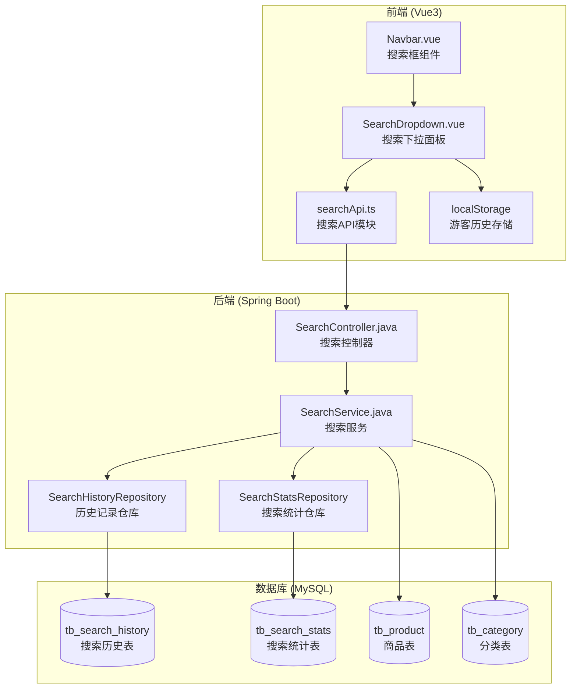

# Design Document: Search Enhancement

## Overview

本设计文档描述商品搜索优化功能的技术实现方案。该功能将增强现有的基础搜索功能，添加搜索历史记录、热门搜索词和搜索建议（自动补全）三大核心能力，并通过统一的下拉面板UI呈现给用户。

### 设计目标

1. **提升搜索效率** - 通过历史记录和建议减少用户输入
2. **增强发现能力** - 通过热门搜索词帮助用户发现热门商品
3. **保持简洁** - 在不增加复杂度的前提下提供更好的体验
4. **兼容现有架构** - 复用现有的Spring Boot后端和Vue3前端架构

## Architecture

### 系统架构图



### 数据流

1. **搜索历史流程**：用户搜索 → 前端调用API → 后端保存历史 → 返回确认
2. **热门搜索流程**：前端请求 → 后端统计查询 → 返回Top 8关键词
3. **搜索建议流程**：用户输入 → 前端防抖调用 → 后端模糊匹配 → 返回建议列表

## Components and Interfaces

### 后端组件

#### 1. SearchController.java

```java
@RestController
@RequestMapping("/api/search")
public class SearchController {
    
    // 获取搜索建议
    @GetMapping("/suggestions")
    public Response<List<SearchSuggestion>> getSuggestions(@RequestParam String keyword);
    
    // 获取热门搜索词
    @GetMapping("/hot-keywords")
    public Response<List<HotKeyword>> getHotKeywords();
    
    // 获取用户搜索历史
    @GetMapping("/history")
    public Response<List<SearchHistory>> getSearchHistory();
    
    // 添加搜索历史
    @PostMapping("/history")
    public Response<Void> addSearchHistory(@RequestBody SearchHistoryRequest request);
    
    // 删除单条搜索历史
    @DeleteMapping("/history/{id}")
    public Response<Void> deleteSearchHistory(@PathVariable Long id);
    
    // 清空搜索历史
    @DeleteMapping("/history")
    public Response<Void> clearSearchHistory();
    
    // 记录搜索统计（执行搜索时调用）
    @PostMapping("/stats")
    public Response<Void> recordSearch(@RequestBody SearchStatsRequest request);
}
```

#### 2. SearchService.java

```java
@Service
public class SearchService {
    
    // 获取搜索建议（商品名+分类名）
    List<SearchSuggestion> getSuggestions(String keyword, int limit);
    
    // 获取热门搜索词（7天内Top N）
    List<HotKeyword> getHotKeywords(int limit);
    
    // 获取用户搜索历史
    List<SearchHistory> getUserSearchHistory(Long userId, int limit);
    
    // 添加搜索历史（去重更新时间戳）
    void addSearchHistory(Long userId, String keyword);
    
    // 删除单条历史
    void deleteSearchHistory(Long userId, Long historyId);
    
    // 清空用户历史
    void clearSearchHistory(Long userId);
    
    // 记录搜索统计
    void recordSearchStats(String keyword, Long userId);
}
```

### 前端组件

#### 1. SearchDropdown.vue

搜索下拉面板组件，包含三个区域：
- 搜索历史区域（带删除和清空功能）
- 热门搜索区域（标签样式展示）
- 搜索建议区域（列表样式，高亮匹配文字）

#### 2. searchApi.ts

```typescript
const searchApi = {
  // 获取搜索建议
  getSuggestions(keyword: string): Promise<ApiResponse<SearchSuggestion[]>>;
  
  // 获取热门搜索词
  getHotKeywords(): Promise<ApiResponse<HotKeyword[]>>;
  
  // 获取搜索历史
  getSearchHistory(): Promise<ApiResponse<SearchHistory[]>>;
  
  // 添加搜索历史
  addSearchHistory(keyword: string): Promise<ApiResponse<void>>;
  
  // 删除单条历史
  deleteSearchHistory(id: number): Promise<ApiResponse<void>>;
  
  // 清空搜索历史
  clearSearchHistory(): Promise<ApiResponse<void>>;
  
  // 记录搜索统计
  recordSearch(keyword: string): Promise<ApiResponse<void>>;
}
```

## Data Models

### 数据库表设计

#### tb_search_history（搜索历史表）

| 字段 | 类型 | 说明 |
|------|------|------|
| id | BIGINT | 主键 |
| user_id | BIGINT | 用户ID（外键） |
| keyword | VARCHAR(100) | 搜索关键词 |
| search_time | DATETIME | 搜索时间 |
| created_time | DATETIME | 创建时间 |
| updated_time | DATETIME | 更新时间 |

索引：`idx_user_time (user_id, search_time DESC)`

#### tb_search_stats（搜索统计表）

| 字段 | 类型 | 说明 |
|------|------|------|
| id | BIGINT | 主键 |
| keyword | VARCHAR(100) | 搜索关键词 |
| search_count | INT | 搜索次数 |
| search_date | DATE | 统计日期 |
| created_time | DATETIME | 创建时间 |
| updated_time | DATETIME | 更新时间 |

索引：`idx_keyword_date (keyword, search_date)`，`idx_date_count (search_date, search_count DESC)`

### 实体类

#### SearchHistory.java

```java
@Entity
@Table(name = "tb_search_history")
public class SearchHistory {
    @Id
    @GeneratedValue(strategy = GenerationType.IDENTITY)
    private Long id;
    
    @Column(name = "user_id", nullable = false)
    private Long userId;
    
    @Column(name = "keyword", nullable = false, length = 100)
    private String keyword;
    
    @Column(name = "search_time")
    private LocalDateTime searchTime;
    
    @Column(name = "created_time")
    private LocalDateTime createdTime;
    
    @Column(name = "updated_time")
    private LocalDateTime updatedTime;
}
```

#### SearchStats.java

```java
@Entity
@Table(name = "tb_search_stats")
public class SearchStats {
    @Id
    @GeneratedValue(strategy = GenerationType.IDENTITY)
    private Long id;
    
    @Column(name = "keyword", nullable = false, length = 100)
    private String keyword;
    
    @Column(name = "search_count", nullable = false)
    private Integer searchCount;
    
    @Column(name = "search_date", nullable = false)
    private LocalDate searchDate;
    
    @Column(name = "created_time")
    private LocalDateTime createdTime;
    
    @Column(name = "updated_time")
    private LocalDateTime updatedTime;
}
```

### DTO类

```java
// 搜索建议DTO
public class SearchSuggestion {
    private String keyword;      // 建议关键词
    private String type;         // 类型：product/category
    private String highlight;    // 高亮HTML
}

// 热门关键词DTO
public class HotKeyword {
    private String keyword;      // 关键词
    private Integer searchCount; // 搜索次数
}

// 搜索历史请求DTO
public class SearchHistoryRequest {
    private String keyword;
}

// 搜索统计请求DTO
public class SearchStatsRequest {
    private String keyword;
}
```

### 前端类型定义

```typescript
// 搜索建议
interface SearchSuggestion {
  keyword: string;
  type: 'product' | 'category';
  highlight: string;
}

// 热门关键词
interface HotKeyword {
  keyword: string;
  searchCount: number;
}

// 搜索历史
interface SearchHistory {
  id: number;
  keyword: string;
  searchTime: string;
}
```

## Correctness Properties

*A property is a characteristic or behavior that should hold true across all valid executions of a system-essentially, a formal statement about what the system should do. Properties serve as the bridge between human-readable specifications and machine-verifiable correctness guarantees.*

### Property 1: Search History Recording

*For any* logged-in user and any non-whitespace search keyword, when the user performs a search, the keyword SHALL be recorded in the user's search history with a valid timestamp.

**Validates: Requirements 1.1, 5.1**

### Property 2: Search History Limit

*For any* user's search history, the API SHALL return at most 10 items, ordered by search time descending.

**Validates: Requirements 1.2**

### Property 3: Search History Deduplication

*For any* user and any keyword, if the user searches the same keyword multiple times, the search history SHALL contain only one entry for that keyword with the most recent timestamp.

**Validates: Requirements 1.6**

### Property 4: Search History Deletion

*For any* user's search history containing item X, after deleting item X, the history SHALL no longer contain item X.

**Validates: Requirements 1.4**

### Property 5: Hot Keywords Limit

*For any* request to get hot keywords, the API SHALL return at most 8 items.

**Validates: Requirements 2.2**

### Property 6: Hot Keywords Time Window

*For any* hot keywords calculation, only searches within the last 7 days SHALL be considered in the frequency count.

**Validates: Requirements 2.5**

### Property 7: Search Statistics Update

*For any* search performed by any user, the search statistics for that keyword on the current date SHALL be incremented by 1.

**Validates: Requirements 2.4**

### Property 8: Search Suggestions Limit

*For any* search suggestion request with a non-empty prefix, the API SHALL return at most 6 items.

**Validates: Requirements 3.2**

### Property 9: Search Suggestions Content

*For any* search suggestion request with prefix P, all returned suggestions SHALL contain P as a substring (case-insensitive) and SHALL include both product names and category names that match.

**Validates: Requirements 3.1, 3.3**

### Property 10: Whitespace Query Rejection

*For any* search query containing only whitespace characters, the system SHALL NOT record it in search statistics or search history.

**Validates: Requirements 5.5**

## Error Handling

### 后端错误处理

| 错误场景 | HTTP状态码 | 错误消息 |
|----------|------------|----------|
| 未登录访问历史记录 | 401 | 请先登录 |
| 关键词为空或纯空白 | 400 | 搜索关键词不能为空 |
| 关键词过长（>100字符） | 400 | 搜索关键词过长 |
| 历史记录不存在 | 404 | 搜索历史不存在 |
| 无权删除他人历史 | 403 | 无权操作 |

### 前端错误处理

1. **网络错误** - 显示"网络异常，请稍后重试"
2. **未登录** - 使用localStorage存储历史，提示登录可同步
3. **API超时** - 搜索建议超过300ms不显示，避免阻塞用户

## Testing Strategy

### 单元测试

1. **SearchService测试**
   - 测试搜索历史的CRUD操作
   - 测试去重逻辑
   - 测试热门关键词计算
   - 测试搜索建议匹配

2. **SearchController测试**
   - 测试各API端点的参数校验
   - 测试权限控制

### 属性测试（Property-Based Testing）

使用 **jqwik** 库进行属性测试：

1. **历史记录限制属性** - 生成随机数量的历史记录，验证返回不超过10条
2. **去重属性** - 生成重复关键词搜索，验证只保留一条
3. **热门关键词限制属性** - 生成大量搜索统计，验证返回不超过8条
4. **建议限制属性** - 生成随机前缀，验证返回不超过6条
5. **空白拒绝属性** - 生成各种空白字符串，验证都被拒绝

### 集成测试

1. **完整搜索流程测试** - 从输入到显示结果的端到端测试
2. **游客/登录用户切换测试** - 验证localStorage和数据库存储的切换

### 前端测试

1. **SearchDropdown组件测试** - 测试各区域的显示逻辑
2. **键盘导航测试** - 测试上下键和回车键的行为
3. **防抖测试** - 验证输入防抖正常工作
