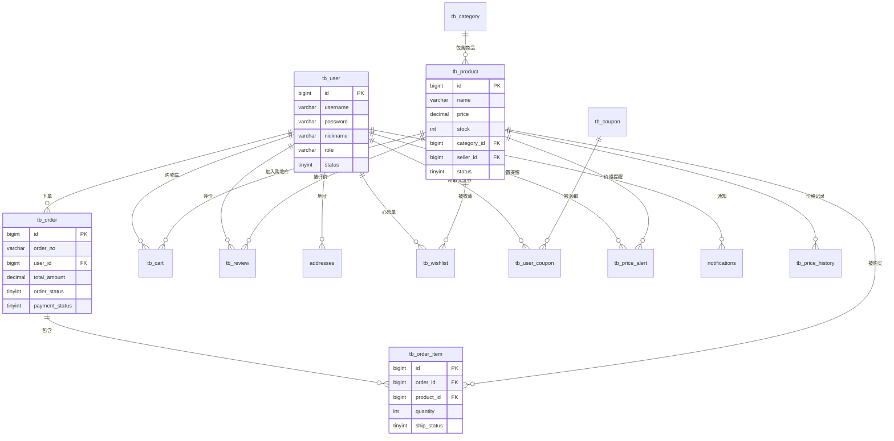

# 数据库表关系图

本文档用可视化方式展示数据库表之间的关系。

---

## 一、核心表关系总览

```
┌─────────────────────────────────────────────────────────────────────────────┐
│                           数据库核心表关系图                                  │
├─────────────────────────────────────────────────────────────────────────────┤
│                                                                              │
│                              ┌──────────────┐                               │
│                              │   tb_user    │                               │
│                              │   (用户表)    │                               │
│                              └──────┬───────┘                               │
│                                     │                                        │
│           ┌─────────────────────────┼─────────────────────────┐             │
│           │            │            │            │            │             │
│           ↓            ↓            ↓            ↓            ↓             │
│    ┌──────────┐ ┌──────────┐ ┌──────────┐ ┌──────────┐ ┌──────────┐        │
│    │ tb_order │ │ tb_cart  │ │tb_review │ │addresses │ │tb_wishlist│        │
│    │  (订单)  │ │ (购物车) │ │  (评价)  │ │  (地址)  │ │ (心愿单) │        │
│    └────┬─────┘ └────┬─────┘ └────┬─────┘ └──────────┘ └────┬─────┘        │
│         │            │            │                          │              │
│         ↓            │            │                          │              │
│  ┌─────────────┐     │            │                          │              │
│  │tb_order_item│     │            │                          │              │
│  │  (订单项)   │     │            │                          │              │
│  └──────┬──────┘     │            │                          │              │
│         │            │            │                          │              │
│         └────────────┴────────────┴──────────────────────────┘              │
│                                   │                                          │
│                                   ↓                                          │
│                           ┌──────────────┐                                  │
│                           │  tb_product  │                                  │
│                           │   (商品表)   │                                  │
│                           └──────┬───────┘                                  │
│                                  │                                           │
│                                  ↓                                           │
│                          ┌──────────────┐                                   │
│                          │ tb_category  │                                   │
│                          │   (分类表)   │                                   │
│                          └──────────────┘                                   │
│                                                                              │
└─────────────────────────────────────────────────────────────────────────────┘
```

---

## 二、详细表关系

### 2.1 用户相关表

```
┌─────────────────────────────────────────────────────────────────┐
│                        用户相关表关系                            │
├─────────────────────────────────────────────────────────────────┤
│                                                                  │
│                        ┌─────────────┐                          │
│                        │   tb_user   │                          │
│                        │─────────────│                          │
│                        │ id (PK)     │                          │
│                        │ username    │                          │
│                        │ password    │                          │
│                        │ nickname    │                          │
│                        │ role        │                          │
│                        │ status      │                          │
│                        └──────┬──────┘                          │
│                               │                                  │
│      ┌────────────────────────┼────────────────────────┐        │
│      │                        │                        │        │
│      ↓                        ↓                        ↓        │
│ ┌─────────────┐        ┌─────────────┐        ┌─────────────┐  │
│ │  addresses  │        │tb_user_coupon│       │notifications│  │
│ │─────────────│        │─────────────│        │─────────────│  │
│ │ id (PK)     │        │ id (PK)     │        │ id (PK)     │  │
│ │ user_id(FK) │        │ user_id(FK) │        │ user_id(FK) │  │
│ │ name        │        │ coupon_id   │        │ title       │  │
│ │ phone       │        │ status      │        │ content     │  │
│ │ address     │        │ used_time   │        │ is_read     │  │
│ └─────────────┘        └─────────────┘        └─────────────┘  │
│                                                                  │
│  一个用户可以有多个地址、多张优惠券、多条通知                      │
│                                                                  │
└─────────────────────────────────────────────────────────────────┘
```

### 2.2 商品相关表

```
┌─────────────────────────────────────────────────────────────────┐
│                        商品相关表关系                            │
├─────────────────────────────────────────────────────────────────┤
│                                                                  │
│  ┌─────────────┐                      ┌─────────────┐           │
│  │ tb_category │                      │   tb_user   │           │
│  │─────────────│                      │  (卖家)     │           │
│  │ id (PK)     │                      └──────┬──────┘           │
│  │ name        │                             │                   │
│  │ image       │                             │                   │
│  └──────┬──────┘                             │                   │
│         │                                    │                   │
│         │  category_id                       │ seller_id         │
│         │                                    │                   │
│         └──────────────┐    ┌────────────────┘                  │
│                        │    │                                    │
│                        ↓    ↓                                    │
│                   ┌─────────────┐                                │
│                   │ tb_product  │                                │
│                   │─────────────│                                │
│                   │ id (PK)     │                                │
│                   │ name        │                                │
│                   │ price       │                                │
│                   │ stock       │                                │
│                   │ category_id │←── 属于哪个分类                │
│                   │ seller_id   │←── 哪个卖家的商品              │
│                   │ status      │                                │
│                   │ audit_status│                                │
│                   └──────┬──────┘                                │
│                          │                                       │
│         ┌────────────────┼────────────────┐                     │
│         │                │                │                     │
│         ↓                ↓                ↓                     │
│  ┌─────────────┐  ┌─────────────┐  ┌─────────────┐             │
│  │tb_price_hist│  │tb_price_alert│ │  tb_review  │             │
│  │─────────────│  │─────────────│  │─────────────│             │
│  │ id (PK)     │  │ id (PK)     │  │ id (PK)     │             │
│  │ product_id  │  │ product_id  │  │ product_id  │             │
│  │ price       │  │ user_id     │  │ user_id     │             │
│  │ created_time│  │ target_price│  │ rating      │             │
│  └─────────────┘  └─────────────┘  │ content     │             │
│                                    └─────────────┘             │
│  价格历史记录      降价提醒设置      商品评价                    │
│                                                                  │
└─────────────────────────────────────────────────────────────────┘
```

### 2.3 订单相关表

```
┌─────────────────────────────────────────────────────────────────┐
│                        订单相关表关系                            │
├─────────────────────────────────────────────────────────────────┤
│                                                                  │
│  ┌─────────────┐                                                │
│  │   tb_user   │                                                │
│  └──────┬──────┘                                                │
│         │ user_id                                                │
│         ↓                                                        │
│  ┌─────────────────────────────────────────┐                    │
│  │              tb_order (订单表)           │                    │
│  │─────────────────────────────────────────│                    │
│  │ id (PK)          - 订单ID               │                    │
│  │ order_no         - 订单号               │                    │
│  │ user_id (FK)     - 用户ID               │                    │
│  │ total_amount     - 总金额               │                    │
│  │ pay_amount       - 实付金额             │                    │
│  │ order_status     - 订单状态(0-6)        │                    │
│  │ payment_status   - 支付状态(0-2)        │                    │
│  │ address_id       - 收货地址ID           │                    │
│  │ coupon_id        - 使用的优惠券ID       │                    │
│  │ created_time     - 创建时间             │                    │
│  │ pay_time         - 支付时间             │                    │
│  │ end_time         - 完成时间             │                    │
│  └──────────────────────┬──────────────────┘                    │
│                         │                                        │
│                         │ order_id                               │
│                         ↓                                        │
│  ┌─────────────────────────────────────────┐                    │
│  │          tb_order_item (订单项表)        │                    │
│  │─────────────────────────────────────────│                    │
│  │ id (PK)          - 订单项ID             │                    │
│  │ order_id (FK)    - 订单ID               │                    │
│  │ product_id (FK)  - 商品ID               │                    │
│  │ product_name     - 商品名称(冗余)       │                    │
│  │ product_price    - 商品单价(冗余)       │                    │
│  │ quantity         - 购买数量             │                    │
│  │ seller_id        - 卖家ID               │                    │
│  │ ship_status      - 发货状态(0-1)        │                    │
│  └─────────────────────────────────────────┘                    │
│                                                                  │
│  一个订单可以包含多个订单项（多个商品）                           │
│                                                                  │
└─────────────────────────────────────────────────────────────────┘
```

### 2.4 购物车表

```
┌─────────────────────────────────────────────────────────────────┐
│                        购物车表关系                              │
├─────────────────────────────────────────────────────────────────┤
│                                                                  │
│  ┌─────────────┐                      ┌─────────────┐           │
│  │   tb_user   │                      │ tb_product  │           │
│  └──────┬──────┘                      └──────┬──────┘           │
│         │                                    │                   │
│         │ user_id                product_id │                   │
│         │                                    │                   │
│         └──────────────┐    ┌────────────────┘                  │
│                        │    │                                    │
│                        ↓    ↓                                    │
│                   ┌─────────────┐                                │
│                   │   tb_cart   │                                │
│                   │─────────────│                                │
│                   │ id (PK)     │                                │
│                   │ user_id(FK) │←── 谁的购物车                  │
│                   │ product_id  │←── 哪个商品                    │
│                   │ quantity    │←── 数量                        │
│                   │ selected    │←── 是否选中                    │
│                   │ created_time│                                │
│                   └─────────────┘                                │
│                                                                  │
│  每个用户可以有多条购物车记录，每条记录对应一个商品               │
│                                                                  │
└─────────────────────────────────────────────────────────────────┘
```

---

## 三、完整ER图（Mermaid格式）

可以复制到支持Mermaid的工具中查看：



---

## 四、表字段详解

### 4.1 tb_user（用户表）

| 字段 | 类型 | 说明 | 示例 |
|------|------|------|------|
| id | BIGINT | 主键 | 1 |
| username | VARCHAR(50) | 登录用户名 | admin |
| password | VARCHAR(255) | 加密后的密码 | $2a$10$xxx |
| nickname | VARCHAR(50) | 显示昵称 | 管理员 |
| email | VARCHAR(100) | 邮箱 | admin@example.com |
| phone | VARCHAR(20) | 手机号 | 13800138000 |
| avatar | VARCHAR(255) | 头像路径 | /uploads/avatar/1.jpg |
| role | VARCHAR(20) | 角色 | ADMIN / USER |
| status | TINYINT | 状态 | 0禁用 / 1启用 |
| created_time | DATETIME | 创建时间 | 2024-01-01 00:00:00 |

### 4.2 tb_product（商品表）

| 字段 | 类型 | 说明 | 示例 |
|------|------|------|------|
| id | BIGINT | 主键 | 1 |
| name | VARCHAR(200) | 商品名称 | iPhone 15 |
| description | TEXT | 商品描述 | 最新款苹果手机... |
| price | DECIMAL(10,2) | 价格 | 5999.00 |
| original_price | DECIMAL(10,2) | 原价 | 6999.00 |
| stock | INT | 库存 | 100 |
| sales | INT | 销量 | 50 |
| category_id | BIGINT | 分类ID | 1 |
| seller_id | BIGINT | 卖家ID | 1 |
| seller_name | VARCHAR(50) | 卖家名称 | admin |
| image | VARCHAR(255) | 主图 | /uploads/product/1.jpg |
| status | TINYINT | 状态 | 0下架 / 1在售 |
| audit_status | TINYINT | 审核状态 | 0待审/1通过/2拒绝 |

### 4.3 tb_order（订单表）

| 字段 | 类型 | 说明 | 示例 |
|------|------|------|------|
| id | BIGINT | 主键 | 1 |
| order_no | VARCHAR(50) | 订单号 | 202401010001 |
| user_id | BIGINT | 用户ID | 2 |
| total_amount | DECIMAL(10,2) | 总金额 | 5999.00 |
| pay_amount | DECIMAL(10,2) | 实付金额 | 5899.00 |
| discount_amount | DECIMAL(10,2) | 优惠金额 | 100.00 |
| order_status | TINYINT | 订单状态 | 0-6 |
| payment_status | TINYINT | 支付状态 | 0-2 |
| payment_method | VARCHAR(20) | 支付方式 | ALIPAY |
| address_id | BIGINT | 地址ID | 1 |
| receiver_name | VARCHAR(50) | 收货人 | 张三 |
| receiver_phone | VARCHAR(20) | 收货电话 | 13800138000 |
| receiver_address | VARCHAR(255) | 收货地址 | 北京市... |
| coupon_id | BIGINT | 优惠券ID | 1 |
| remark | VARCHAR(500) | 备注 | 请尽快发货 |
| created_time | DATETIME | 创建时间 | |
| pay_time | DATETIME | 支付时间 | |
| end_time | DATETIME | 完成时间 | |

### 4.4 tb_order_item（订单项表）

| 字段 | 类型 | 说明 | 示例 |
|------|------|------|------|
| id | BIGINT | 主键 | 1 |
| order_id | BIGINT | 订单ID | 1 |
| product_id | BIGINT | 商品ID | 1 |
| product_name | VARCHAR(200) | 商品名称(冗余) | iPhone 15 |
| product_image | VARCHAR(255) | 商品图片(冗余) | |
| product_price | DECIMAL(10,2) | 商品单价(冗余) | 5999.00 |
| quantity | INT | 数量 | 1 |
| seller_id | BIGINT | 卖家ID | 1 |
| seller_name | VARCHAR(50) | 卖家名称 | admin |
| ship_status | TINYINT | 发货状态 | 0待发货/1已发货 |

> **为什么要冗余存储商品信息？**
> 因为商品价格可能会变，但订单中的价格应该是下单时的价格，所以需要冗余存储。

---

## 五、表关系说明

### 5.1 一对多关系

| 关系 | 说明 |
|------|------|
| 用户 → 订单 | 一个用户可以有多个订单 |
| 用户 → 购物车 | 一个用户可以有多条购物车记录 |
| 用户 → 地址 | 一个用户可以有多个收货地址 |
| 用户 → 评价 | 一个用户可以发表多条评价 |
| 订单 → 订单项 | 一个订单可以包含多个商品 |
| 分类 → 商品 | 一个分类下可以有多个商品 |
| 商品 → 评价 | 一个商品可以有多条评价 |
| 商品 → 价格历史 | 一个商品可以有多条价格记录 |

### 5.2 多对多关系

| 关系 | 中间表 | 说明 |
|------|--------|------|
| 用户 ↔ 优惠券 | tb_user_coupon | 用户领取优惠券 |
| 用户 ↔ 商品(购物车) | tb_cart | 用户添加商品到购物车 |
| 用户 ↔ 商品(心愿单) | tb_wishlist | 用户收藏商品 |

---

## 六、状态流转图

### 6.1 订单状态流转

```
                    ┌─────────────────────────────────────────┐
                    │              订单状态流转                │
                    └─────────────────────────────────────────┘
                    
    ┌─────────┐     支付      ┌─────────┐     发货      ┌─────────┐
    │ 待付款  │ ──────────→  │ 待发货  │ ──────────→  │ 待收货  │
    │  (0)   │              │  (1)   │              │  (2)   │
    └────┬────┘              └────┬────┘              └────┬────┘
         │                        │                        │
         │ 取消                   │ 申请取消               │ 确认收货
         ↓                        ↓                        ↓
    ┌─────────┐              ┌─────────┐              ┌─────────┐
    │ 已取消  │ ←─────────── │申请取消中│              │ 已完成  │
    │  (4)   │    同意取消   │  (6)   │              │  (3)   │
    └─────────┘              └─────────┘              └─────────┘
```

### 6.2 商品审核状态流转

```
    ┌─────────┐     审核通过     ┌─────────┐
    │ 待审核  │ ──────────────→ │ 已通过  │
    │  (0)   │                  │  (1)   │
    └────┬────┘                  └─────────┘
         │
         │ 审核拒绝
         ↓
    ┌─────────┐
    │ 已拒绝  │
    │  (2)   │
    └─────────┘
```

---

## 七、查询示例

### 7.1 查询用户的所有订单
```sql
SELECT o.*, u.username 
FROM tb_order o
JOIN tb_user u ON o.user_id = u.id
WHERE o.user_id = 1;
```

### 7.2 查询订单的所有商品
```sql
SELECT oi.*, p.name, p.image
FROM tb_order_item oi
JOIN tb_product p ON oi.product_id = p.id
WHERE oi.order_id = 1;
```

### 7.3 查询分类下的所有商品
```sql
SELECT p.*, c.name as category_name
FROM tb_product p
JOIN tb_category c ON p.category_id = c.id
WHERE p.category_id = 1 AND p.status = 1;
```

### 7.4 查询用户的购物车（带商品信息）
```sql
SELECT c.*, p.name, p.price, p.image, p.stock
FROM tb_cart c
JOIN tb_product p ON c.product_id = p.id
WHERE c.user_id = 1;
```

---

**理解了表关系，就理解了数据是怎么组织的！** 📊
